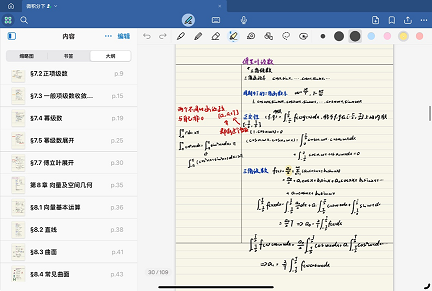
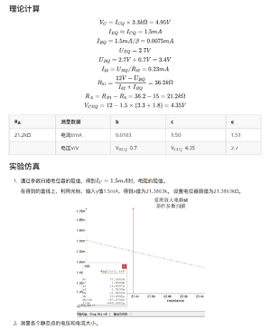
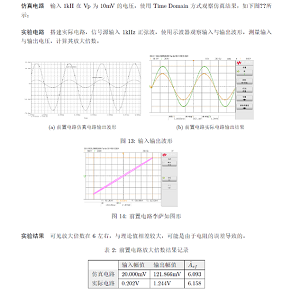

## 课程笔记

#### 电路原理

* **21级 金怡婷** 
	* [第四章](./电路原理/第四章.pdf)
	* [第八章和第六章](./电路原理/第八章和第六章.pdf)

#### 数电

* **21级 金怡婷** [数电](./数电/数电.pdf)
* **22级 会飞的鱼** [电路与电子技术2（爱班数电笔记）](./数电/电路与电子技术2.pdf)
* **23级 鲸鱼** [数电](./数电/电路与电子技术1.pdf)

#### 模电

* **21级 金怡婷**
  1. [半导体部分笔记](./模电/半导体部分笔记.pdf)
  2. [模电复习笔记](./模电/模电复习笔记.pdf)
* **23级 鲸鱼**
* [模电课程笔记](./模电/电路与电子技术2.pdf)

## 课程感想

=== "Firisy 电子信息工程"

	**E点瞥见，电亮未来**
	
	作为电气工程学院的入门专业基础课程，电路与电子技术以其庞大的体量（6学分+3学分+1.5学分*2的实验课），惊人的难度（模电为电院四大天书之一），让初入电院大门的“新生们”极易望而生怯。然作为电院所有课程开展的基石，不深入学习或（以功利角度表述）在本课程并没有取得满意的成绩，都将为后续的本科学习徒增烦恼，大增难度。虽然课程本身压力较大，然而以更为轻松的视角去深入本门课程并非无迹可寻。本篇将以学习电路与电子技术系列课程（即电路原理、模拟电路、数字电路理论课及其实验课）的路径作为主线，谈谈本人学习这门课程的心路历程以及一些摸索出来的方法与见解。
	
	**一、“万事开头难”，如何开始**
	
	开始，是一个阶段的结束，新阶段的起点。一个阶段的结束，指微积分、大学物理、复变函数这些最为基础的通识课的结束，这些课程为电路与电子技术的开展打下了极为重要的基础。这些课程主要为电路与电子技术提供了以下工具：
	
	1. 微分与积分的数学工具（微积分）；
	2. 电学的基本知识：电压、电流的基本概念（大学物理）；
	3. 复数的计算，从时域变换到复频域角度的思考方式（复变函数）；
	
	掌握以上三点基本的内容，就可以信心满满的正式进入电路与电子技术的学习。课程中所运用到的数学工具并不会过于复杂，然而可能会由于不够熟练而感到困惑。这时候及时复习过往课程的笔记就显得非常重要。我个人利用GoodNotes这一软件进行电子的手写笔记；将多门课程笔记以电子的方式存储一方面是便携、不易丢；另一方面，在课程上对过往内容联想时，非常便于及时查看；还有一方面，可以在每个知识点周围进行大量留白，也不会感到环保角度对纸张浪费的可惜，笔记是常看常新，留白处为后续记录新思考留下了空白之处；与此同时，其大纲的功能很好地帮助我整理笔记、复习知识点。
	
	
	
	在准备完基础内容后，就进入了正式的电路与电子技术学习课堂。
	
	**二、“功夫在平时”，在课堂中**
	
	
	
	课堂上最高效汲取知识的方式是做好充分的预习准备。虽然课业繁重，挤压着自主学习的时间，但是基本的预习是必要的——大致预测老师课堂会讲的内容，在内心中有一个大纲。这种方式能够帮助自己在课堂上以知识点的方式，获取上课内容，从而一方面避免由于无目听课导致的走神；另一方面即便走神，也可以清晰了解哪一部分是自己并不理解的，在课后及时通过智云课堂、书本、学在浙大上老师的资料进行补充学习，而非从头开始，漫无目的再次听课。
	
	其次，我认为对我学习过程中最有帮助的部分，是整理课堂笔记。如模电部分，有非常多庞杂的电路图，而在课后仔细重新绘制电路图，重新推导电路中的关系，一方面帮助自己消化理解课堂老师所讲，另一方面循序渐进帮助自己记忆相关知识点。在绘制过程中，也时常会发现新的器件、新的线路，而他们有着自己独特的存在意义，可能课堂上一笔带过，但绘制时产生的疑问使自己对其的理解更深一层次。
	
	以下是电路与电子技术中各模块中比较重要的部分。
	
	4. 电路原理：电路图、推导关系式。学习路上会碰到的三次瓶颈：瓶颈一，电路定理的运用，要求对电路定理深刻掌握并灵活运用；瓶颈二，第一次碰到从时域考虑转变为从频域考虑电路，将正弦的电压表达式转变为相量分析；瓶颈三，暂态分析，开始学着解有实际含义的常微分方程，并且理解常微分方程中各项的含义。
	5. 模拟电子技术：电路图，关系式的理解。各类放大电路的区分，负反馈概念的第一次接触，各类非线性器件的熟悉。
	6. 数字电路分析：一些基本的逻辑电路构造。相对来说较为简单，一方面能够对逻辑表达式的进行简化，另一方面学会使用各类数字芯片，即能够较好地完成该门课程的学习。
	
	虽然现在有非常多替代课堂学习的手段，但是听取课堂内容还是极为必要的。作为工科学科，除了从理性上的数学推导去了解电路最基本的性质与原理，还需要逐渐建立对电路、器件的感性认知，而这种认识需要通过“过来人”进行指导。去“感觉”这个电路，具体体现在，如面对复杂电路时，能够抓住其中的关键主导部分；面对复杂的计算式时，能够通过合理简化，从而得到优雅简洁的结果。在老师的课堂上，不仅仅需要去听取考试的知识点；观看老师如何简化这一电路，如何抓住其中的主要矛盾，也为未来自主学习进行了非常好的铺垫。
	
	短则八周，长则十六周的课程需要我们建立一个每一步有过程，阶段性有成果的学习路径。以一节课至下一节课之间的时间，作为自己厘清每个知识点的界限，让自己的学习节奏有一些被排满的吃力感，却避免了事情堆积在一起的窒息感。
	
	**三、“临阵磨刀”，如何考试**
	
	学习的目的绝非考试，但考试也为关键的一环。课程的八周或十六周是面向知识点的汲取过程，而临近考试绝对转变为“面向考试”的复习。电路与电子技术课程的知识点十分明晰，课程最后，老师一般会划清考试范围。针对范围，确定其中的每一个知识点是否掌握，是否根据考试要求有着相对应的熟练程度是复习的第一步。如下图所示为我在考试前列出的关键知识点，复习时按照脉络大概厘清需要掌握哪些知识即可。在课程过程中整理的笔记起到了极大的作用，那时课堂中的所思所想通过笔记再次映现至脑海之中。
	
	
	
	在复习过程中，我会按照单元复习。在复习笔记和知识点后，对课后习题进行练习，随后再巩固知识点。面对有较大计算量的部分，会在课后习题、课件中寻找同类型题目，多次计算，增加熟练度。而老师往往在课堂中会提供一些较难的题目，作为拓宽思维或是视野，相对应的我会将其放在最后复习，其并非提分的关键。
	
	电路电子课程还有一个特点，即没有历年卷可供参考（所谓印刷的历年卷内容并不真实准确）。这时“刷题”提分会变得困难。但知识点本身并没有历年卷可言。我不提倡刷题，也不提倡绞尽脑汁寻找所谓历年卷资源，因为知识点本身需要理解，而不是简单刷题、寻找套路即可获取高分。
	
	“面向考试”的复习，指复习要有关键性，在人脑容量有限的情况下，着重强调对“考试”内容的复习与记忆，而并非“面向考试卷”的复习。仍然强调的是学习的过程性，而并非结果性。
	
	**四、“绝知此事要躬行”，谈谈实验与其报告**
	
	 
	
	电路与电子技术的实验所占学分比重不大，但是内容要求不低。且由于本人加入爱迪生班，教学中更加强调实验的比重。做实验过程本身的反复调试足够磋磨一个人的耐心，课后完成相对应繁杂的实验报告更添烦恼。但还是希望能够在踏实的实践过程中，逐渐培养自己动手的能力，也是将理论转化为实际的能力。
	
	实验报告的确有很多可供参考的学长姐资料，但是在经过一年的课程学习之后，我认为学会自己打公式、推导实验公式，总结自己的结论，调试出自己的程序代码对自我的提升远大于完成实验内容本身。从使用MatLab时畏手畏脚，到能够用各类软件包括Python语言对数据进行处理；从使用Word进行报告编排，到自学LateX减轻排版烦恼；从看器件手册不懂器件参数含义，到能够自主挑选合适的器件。慢慢通过实践摸索进入电气的大门是一方面的改变，而不畏惧任何未知的软件、工具是更大的自我提升。
	
	**五、“人生是旷野”，谈谈心态**
	
	电路与电子技术是专业学习生涯中的第一块险坡，然而爬坡的过程绝非无氧地埋头前冲，而应该保有自己的节奏循序渐进向前进。“循序渐进”是我在学习过程中自视最重要的一个词。它避免了一方面的急于求成，认为知识是可以以冲激函数的形式进行积累；也避免了在学习过程中的懈怠。人生是旷野，但也是有着追求目标的前进。
	
	人生是旷野的另一个视角是“自由”地享受。不要指责自己，不要后悔，反思是必要的但绝不是要自己的意志消沉。我们或许容易有这些想法，微积分我获取了不好的分数，我可能就学不好接下来的理工科课程；我可能因为前一天的娱乐，忽视了这几日的学习；可能由于学生工作，这一周都做不到预留时间预习课程。以上所有生活的错乱与一时的苟且，都将不经意间敲击自己的节奏，然后打乱自己的心态，试图让你跟自己说“我无法学好这一门课程”。但它们与你过度指责自己时的证词无关。微积分可以没考好，但是我懂得积分与微分的含义，能够进行简单的计算，就意味着掌握了电路与电子技术中最基本的分析工具；一时对学习的放松，总能够通过后期的补课、看书弥补。尽情地享受大学生活，尝试鼓起勇气走上讲台询问老师几个感觉愚蠢的问题，在一个夜晚去阅读一本书，也正如尝试通宵玩一个游戏，和朋友们聊天到朝阳初升一样值得自己在“地球在线”这款现实游戏中进行挑战。
	
	大学中，我们或功利或理想、或急切或肆意去追求或清晰或不定的目标，但，愿你忠于自己所热爱的事，愿你找到自己存在的方式，愿你快乐且自由，高尚且坚定。

=== "会飞的鱼 22级电气工程及其自动化"

	**电路与电子技术1（爱班）**
	
	爱班这门课两个学期分别上的是电路原理和模电部分，最后的考试内容期中期末是独立的，但总成绩由两次考试按比例加权得到。
	
	电路原理主要介绍的是一些电路的计算方法，可以说是高中物理电路分析的plus版，在理解的基础上多做习题还是可以轻松拿下的，实在不理解的话通过刷题记忆典型的电路模型和求解套路也能拿到不错的分数。这里给大家推荐几本质量较高且和我们的学习内容能匹配的习题集，在浙江大学图书馆也可以借阅到：李玉玲《电路原理学习指导与习题解析》，李盛才《电路原理复习指导：经典题及考题解析》。还有很多类似的习题集大家可以慢慢挖掘，找到最适合自己的，这些习题集在之后学习电网络分析的时候也可以接着用，在习题集的最后面还有考研真题，考前可以拿来练手。
	
	
	
	模电部分介绍的是含有电力电子器件的电路的分析，最基本的就是由二极管、三极管、mos管组成的复杂电路。模电的学习比较玄学，因为他追求的不是准确的计算，而是对元器件特性的理解，最后在利用器件输入输出特性的基础上得到一个估计值，包括最后的考试也只需要列出计算公式不需要求解，所以对于这些电力电子器件各个引脚之间的电压和电流关系需要有非常深刻的理解和准确的记忆。个人感觉**手画电路图+自行推导电压电流转换公式**对于理解和记忆有较大的帮助，虽然老师的ppt上会有电路图和推导过程，但是看一遍公式对着ppt思考往往都会以为自己记住了，但是让自己写的时候还是写不出来。自己画电路图的时候最好也能脱离ppt和书本，如果能再不参考任何资料的情况下把电路图和公式全部写出来，在考试的时候有70%的概率能高分上岸了。剩下的30%需要**对常见的电路模型有一定的积累**，比如电流源电路、差分电路、开关电路等等，这些电路只要一出现就需要能够判断出来它们的类型，这对于看懂复杂电路有很大的帮助。最后运算放大器这一块的学习精髓在于“虚短”“虚断”的理解，只要通过正负输入引脚电位相等，输入电流为零联立方程组求解就可以得到想要的结果。由于课本的讲解比较简单，老师上课主要介绍的也是器件的外部特性，想要理解完整的各个器件功能实现的内部逻辑还需要去借鉴别的参考书，这里也给大家推荐一本个人认为很好用的教辅，里面有很多经典模型的整理并且有内部逻辑的详细解释，供大家参考。ps：数电的这套教辅也很好用。
	
	

### 往届课程感想

=== "陆琦 电气工程及其自动化1804"

    我大二时上的爱班的电路与电子技术，大二秋是姚缨英老师上的电路原理部分，大二冬是林平老师上的模电部分，大二春夏是林平老师上的数电部分。对这课的整体感受是：大二秋冬的电路与电子技术上课的节奏比较紧凑，相信不少爱班同学都还记得被一周两次模电课支配的恐惧；大二春夏数电部分的上课节奏就比较舒服，一周只用上一次课。 
    
    电路原理部分：讲的东西比较浅显易懂，主要是概念比较多比较杂，如果大家有高中物理的电路基础的话，这部分内容接受起来应该比较快。考试的话，解题思路大多比较常规，有部分题可能会涉及一些作业里出现过的技巧，建议大家自己认认真真地做一遍课后习题，有些老师还会布置一些课上的习题，大家考试前都可以刷一刷。 
    
    模电部分：难度比电路原理上升了一个等级。建议大家在做作业之前自己先把书上或ppt上的东西推导一下，理解知识点。除了平时好好把作业写了之外，最重要的是自己能看一遍书，归纳好每一章内容提到的模型。 
    
    数电部分：这门课由于疫情关系我是在线上上的，当时林平老师的授课方式是让我们课下先自己看一遍中国大学mooc上的网课（相当于预习一遍），课上他会再过一遍知识点。强烈安利一波中国大学mooc上林平老师和其他老师开设的数电网课，这个网课的内容教授得非常清楚！因为数电本身知识点并不多，但是题量比较大，所以考试前我复习数电的策略是，先快速过一遍知识点，然后多做一做课后题。 
    
    提示：咱们学院开设的数模电课和信电那边的还是有所不同的，信电那边会讲一些器件的底层原理，所以大家如果打算跨修信电的大三课程，建议先学他们的数模电的教材或ppt，不然上课听起来会比较吃力。 最后，祝大家在电路与电子技术这门课上都能取得满意的成绩！

=== "周泽 电气工程及其自动化1801"

    1.勤画图，比较形象，可以加深记忆和理解，比如模电的各种器件的等效模型。
    
    2.针对考试，多翻课本，弄懂课后习题即可 
    
    3.模电的题目，很多都是实际的应用场景，要弄懂题目涉及的各个器件的作用 
    
    4.找共性，电和磁还是有很多比较像的地方。 
    
    5.模电的基础元器件要学好，各种特性，曲线，这样后面学起来就比较轻松，难点在前期 
    
    6.公式熟记，通过做练习加深印象和理解。 
    
    7.复习做整理时不要照抄课本，按自己的理解编写自己能看懂的教材即可。

=== "王晨旭 自动化1801"

    电路部分基础要打好，基本的计算方法需要熟练掌握，包括回路电流、节点电压定律都要牢固掌握。同时电网络分析中有大量涉及控制理论（laplace）、线性代数（双口网络、网络矩阵方程）、偏微分（分布参数电路）等，需要特别注意知识的融合。这门课也是你们电气工程后面进行电力系统分析的最基础内容，一定要重视。实验的话我就不多说了，multisim、pspice都要比较熟练掌握。

