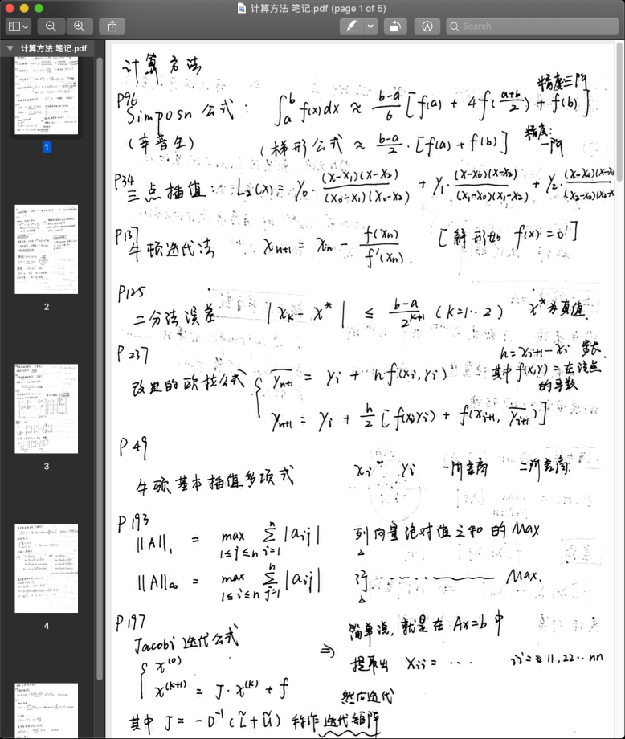

## 课程笔记

* **21级 金怡婷** [计算方法笔记](计算方法笔记.pdf)

## 课程感想

### 往届课程感想

=== "林志濠 电气工程及其自动化1805"

	**一、关于心得**

	​其实在学这门课的时候，自己是一直把它当作数学课来学的，不过实际上它就是一门数学课：里面有许许多多的公式，为的就是如何根据已有的数据来推测未知数据上的点。不过，在深入或者死记硬背这些公式之前，我想最重要的是知道“这到底是如何推测”这样的整个过程，如果知道它背后的原理，也就是为什么（intuition），其实这门课就会变的非常简单了。

	
	
	举个简单的例子，比如书本中的拉格朗日插值法，这个其实还是挺常见的，作用呢就是找到一个多项式经过所有给定的点，和平时的待定系数法作用一样。但是如果仔细去想想它背后的原理，为什么有这么一个东西的时候，其实里面还是有一定深度可以去挖掘：比如里面的Δi 为什么设定为这样？如果只是简单的带进去符合某些条件这样正向地推导，其实是得不出什么结论的。但是如果换个角度，比如要插值的是(1, b1), (2, b2), (3, b3) 这三个点，那么Δ1 所对应的点就恰好是(1, 1), (2, 0), (3, 0) 这三个点，把这些点的y 坐标拿出来，也恰好是(1, 0, 0)T 这么一个基向量，也正是线性代数里面的内容。这个时候，就可以看出联系了，如果还记得线性代数里面正交基的概念，那么所有Δi 所构成的向量就正好是n个正交基，也正好是一个单位矩阵I. 然后再根据线性的关系，就可以还原出原来的多项式。

	​其实类似这样的例子还有很多，我想表达的意思就是，如果知道了背后为什么这样做的原理，稍微深度地去挖掘一下，那么这门课就会被你学的很透彻了，最后考试也就不怎么难了。

	**二、关于教材**

	​关于教材，它里面的知识点是比较密集的，而且也不会向你娓娓道来为什么有这么一个东西的前因后果，所以希望同学您在上课听课时如果老师讲到教材上所没有的，像上述一样比较有原理性的东西，还请注意聆听。（如果老师也没有讲到，那这时如果自己也想知道，也就只能依靠自己了）以及，或许也可以看看别的教材，也可以看看英文教材，如Numerical Analysis（小声逼逼），里面一般都会有更详细地解释，当然前提是你有兴趣，并且真的想学好，并且其实完全自学也是完全没问题的。

	**三、关于考试**

	​考试一般都是最被人关心的。这里我推荐一下校内学习网站cc98 ，上面都会有前辈们留下来的回忆卷，练习题之类的，是非常好的考前练习的资源。如果还不知道这是个什么网站的同学，请记得早点关注这个网站。记得当时我是在考前用到了这个帖子里面的练习题。

	​以及可以推荐一下同学们可以在考前整理一下书里面的几个重要的公式，什么？您说里面有好多，能写好几页的公式。是这样的，记得我也整理几面，但是实际上最后的考试并不会涉及到非常复杂的公式，比如三次样条插值等不会考到。但是也还是非常推荐同学们整理到几张白纸上，考试前几天背好进考场就行了。

	

	图1: 类似这样的公式整理

	再至于其他的，我想大家都有好几年的应试技巧，也就不需要在这里重复了，最后祝大家考出个好的成绩。

=== "钱立群 电气工程及其自动化1801"

	**一、课程心得体会**

	​首先我想说我们所学的计算方法应该是我们专业最简单的专业课了。

	​我们的计算方法是由电气学院自己开设的，而且只面向电气工程及其自动化专业的同学。对比数院开设的同名课程，我们并不需要完全掌握每一种数值计算的相关证明，我们只用知道这种方法如何进行计算，以及比较相似方法的差别、优缺点就可以了。所以，如果想在这门课程中取得不错的绩点，就必须牢记每一章节相关的计算公式与方法，比如牛顿迭代法、LU分解、牛顿插值（差商表）等。这些公式并不需要我们特别去记忆，只要能够保证每一次的作业、实验都是自己经过独立思考完成的就可以了。当然，如果能消化吸收老师课件里的推导证明过程，那这也有助于我们记住公式以及同类方法的差别。

	​我们学院计算方法的另一个特点就是有要求使用MATLAB进行编程。MATLAB在本专业后续的学习中运用非常的广泛，虽然期末考试中并不考察相关内容，但是作为MATLAB的入门学习，请务必认真对待每一次的实验，善用“help”与断点。或者也可以按耿光超老师建议的来，即每一次的课程作业都通过写MATLAB代码来完成计算得出答案，通过这样一个编写代码的过程，一方面提高自己MATLAB编程的熟练度，另一方面也可以加深对这种计算方法的认识。

	**二、考试的小建议**

	1. 不需要买文印店的复习资料。蓝田文印店的“计算方法”是数院开设的计算方法，买了你也不会做。认真看老师的PPT，掌握PPT中的例题与作业题就可以了。
	2. 考试允许使用计算器，所以一定要带上！在平时抽空了解手中计算器的功能，像卡西欧991就支持矩阵计算，不然考试的时候你可能需要手算矩阵了（矩阵阶数不会高，手算也简单的）。
	3. 细心！细心！细心！
	4. 祝大家取得好成绩啦~

=== "季宇 电气工程及其自动化1803"

	**一、课程心得体会**

	​计算方法这门课是一门偏向于工程应用的课程，其中涉及的数值计算的方法无论是在后续的课程学习中还是SRTP等科研项目中都有广泛的应用。例如，我最近正在修读电机系统建模与分析涉及到了常微分方程的数值解法，其中的欧拉法与龙格库塔法正是计算方法这门课程的核心内容之一，同时，在此前我参加的数学建模中，求解传染病SIR模型的关键也是常微分方程的数值解法，可见，计算方法是一门十分实用的课程，学好这门课所带来的收益是巨大的。

	​在学习计算方法的过程中，学会用计算机的思维去理解问题很重要，因为这门课程的核心是教会我们用计算机求解相关的工程问题，有时需要我们暂时抛弃掉学习微积分等课程时的思维。在学习微积分等数学课程时，我们总是希望能够得到真值或精确的表达式，但是在计算方法中，我们要学习的是在不能得到精确解的情况下使结果尽量接近真值的方法。计算机最擅长的就是重复做加减乘除等基本运算，计算方法教给我们的就是将工程问题转换为重复的加减乘除的步骤，并让计算机完成这些机械并且重复的工作。

	**二、学习方法和建议**

	​针对这门课程的特点以及我的学习心得，我认为以下方法对学习该课程会有较大的帮助：

	①  不必过分拘泥于结论的具体推导过程，因为推导过程往往是复杂的数学定理的运用，并且也较为繁琐，对于简单的推导，可以尝试去记忆与理解，这样也有助于结论的运用，对于某些十分复杂的推导，只要大致知道结论的来源就可以，最重要的是掌握运用结论的方法，毕竟这是一门偏向于应用而不是理论推导的课程

	②  认真对待课后的书面作业和编程作业，这是非常好的理解结论和运用结论的机会，若书面作业和编程作业都能独立自主完成，那么最后的考试也不会有太大的问题

	③  学习过程中要细心，很多结论和公式都有比较长和复杂的下标，不注意就容易混淆

	④  及时归纳整理，许多章节的内容较多且复杂，若临近期末才进行整理容易“翻车”，历年卷可以早点开始刷，尽早了解题型

	⑤  如果现在有时间，可以提早开始MATLAB的学习，掌握基本的编程方法，有助于后续课程的学习。